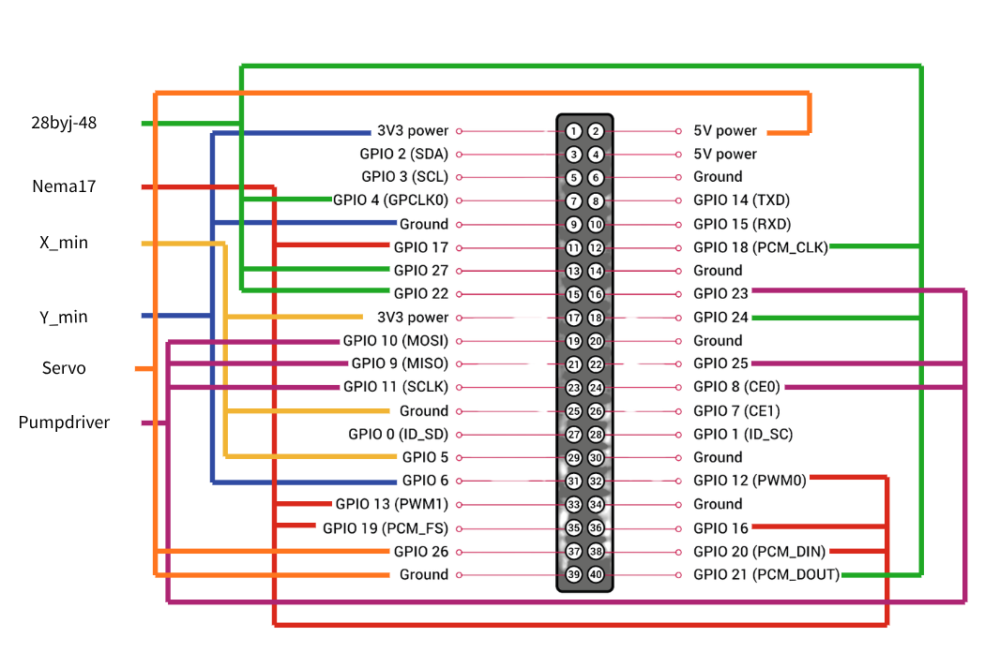
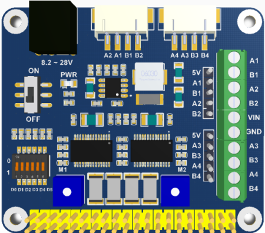

## User manual
Hi! This is a manual about the washing robot, where you will hopefully find everything you need. This manual is written for someone who uses Linux, so some (most) of the terminal code might not work on Windows

#### Table of contents
1. Explaination of hardware system
2. Use in pactice
3. Error handeling
4. Contact information


#### Explaination of the system

The goal of this robot is to clean the window of the Mini-DOAS as good as possible. For this, it uses the following hardware (only inluding actuating and controlling hardware):

- 1x RPi5 (with SD)
- 1x Waveshare Stepper HAT
- 1x L298N motor driver module
- 1x NEMA17 1.8 degree stepper motor
- 1x 28BYJ-48 5v stepper motor
- 2x 12v waterpump
- 1x Continuous servo 5v
- 2x Mechanical stops
- 1x powersupply RPi5
- 1x Powersupply Stepper HAT (9-12v, 2-3A)
- 1x Powersupply L298N 12v

The Pi forms the basis of the system. The stepper HAT is mounted on top of the Pi, to which the NEMA17 and 28BYJ-48 are attached. In the image below you can find how the rest of the hardware should be connected to the pins.




#### Use in pactice

Before setting up the Hardware (or atleast more than you can carry to a watersafe location), connect your laptop to the Pi via ssh. You can use this [turtorial](https://www.raspberrypi.com/documentation/computers/remote-access.html#ssh) for example. 

Before we connect the stepper HAT to the Pi, make the stepper HAT compatible for both the 2-3A NEMA17 and the 500mA 28BYJ-48. Do this by checking the current through M1 and M2 and adjusting where needed, as described in the [HAT's own documentation](https://www.waveshare.com/wiki/Stepper_Motor_HAT#Current_Setting). Make sure to attach the HAT's powersupply and switching the power to 'On'. 

If you do not check this beforehand, you risk that either one is getting to low or, in the case of the small stepper, to high of a current; the latter resulting in overheating.



Attach the NEMA17 to the white A2A1B1B2 insert, as seen in the top of the image of the HAT. Attacht the small stepper motor the to male 5VA3B3A4B4 insert (the red wire should go into the 5v).

Wire the rest of hardware as in the pin layout given above. 

Now attach the controlwires for the L298N, using the using the pin list below to their corresponding pin denoted on the driver module:

* ENA = 8 
* IN1 = 9
* IN2 = 10
* IN3 = 11
* IN4 = 23
* ENB = 25

Also attach the 12v powersupply to the driver module.

To the pumps, attach the tubes and run them through the bottomplate. Attach the nozzle to the tube and then the nozzle to the clip on each side of the hood.

To activate the program, move to the working directory and use ```python3 main.py``` to activate the system. Here you can choose to either do a calibration, a test or use manual controls. 

If you just want to control the robot, use manual. If you want to calibrate the right position for autonomous washing, use calibration. To do a test run, use test! The controls will be displayed when activated. 

#### Error Handeling


```Error opening serial port '/dev/ttyUSB0': No such file or directory```  
This means that the Pi does not see that the arduino is connected via USB0. This can be either true, or it is in the port, but is does not see it. To get rid of the error, disconnect the cable, reboot the Arduino and reconnect the cable (rebooting the Pi is also possible, but that takes longer).

The reason the error occured for us was due to the fact that we ran more volt through it then the Arduino wanted, which is probably why it would disconnect itself. Make sure to use a powersupply of 5v, or a max of 7v (we did this a bit experimentally). 


```Error: invalid sketch name, the sketch name must match the folder name``` on Arduino  
This error occurs when the name of the Sketch (.ino) is not the same as the folder it is in. So match them!

#### Contact information

- Pepijn ten Hoor
- Tijl Smeets
- Mahitaap Ahmed
- Naud Sluis (naud.sluis@gmail.com)


